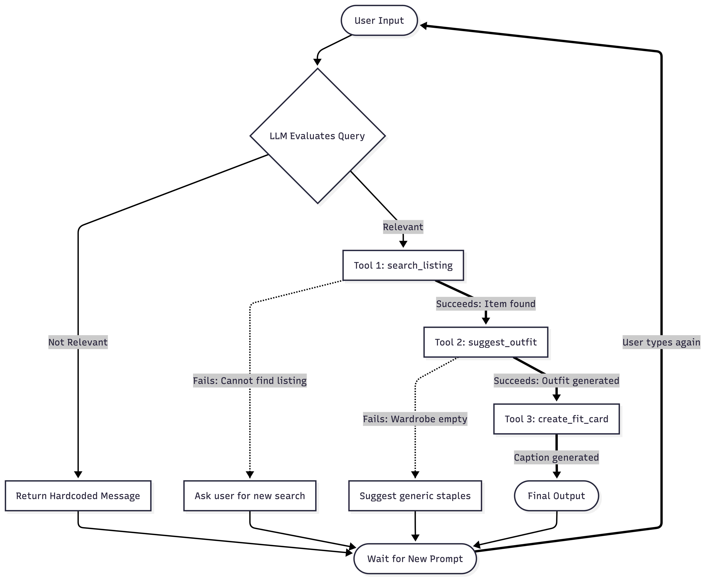

# FitFindr 

FitFindr is an AI styling assistant that helps you shop second-hand more easily by finding clothes that match your budget and style. It also looks at your digital closet to build complete outfits using items you already own, and even creates ready-to-post social media captions so you can share your sustainable fashion finds.


## Setup

```bash
pip install -r requirements.txt
```

Set your Groq API key in a `.env` file (get a free key at [console.groq.com](https://console.groq.com)):
```
GROQ_API_KEY=your_key_here
```

## The Mock Listings Dataset

`data/listings.json` contains 40 mock secondhand listings across categories (tops, bottoms, outerwear, shoes, accessories) and styles (vintage, y2k, grunge, cottagecore, streetwear, and more).

Each listing has: `id`, `title`, `description`, `category`, `style_tags`, `size`, `condition`, `price`, `colors`, `brand`, and `platform`.

Load it with:
```python
from utils.data_loader import load_listings
listings = load_listings()
```

## The Wardrobe Schema

`data/wardrobe_schema.json` defines the format your agent uses to represent a user's existing wardrobe. It includes:

- `schema`: field definitions for a wardrobe item
- `example_wardrobe`: a sample wardrobe with 10 items you can use for testing
- `empty_wardrobe`: a starting template for a new user

Load an example wardrobe with:
```python
from utils.data_loader import get_example_wardrobe
wardrobe = get_example_wardrobe()
```

## Tools

### `search_listings`
Searches the thrift catalog for items based on user input like description, size, and budget.  
It acts as the discovery engine and only returns relevant matches. If nothing fits, it helps guide the user to adjust their search.

---

### `suggest_outfit`
Builds outfits using AI styling logic.  
- If the wardrobe is empty → gives styling advice  
- If wardrobe has items → combines a new thrift item with existing clothes to create a complete outfit (returns structured JSON)

---

### `create_fit_card`
Generates social-media-ready content for a finished outfit.  
Turns outfit details into:
- A caption  
- Hashtags  
So users can easily share their looks online.

---

### Error Handling
All tools are built to handle failures gracefully (e.g., empty wardrobe, no matches, or tight budget) and return helpful messages instead of breaking.

## Error Handling & Resilience

FitFindr is designed to fail gracefully. Instead of crashing, it detects issues and either guides the user or provides a fallback response.

---

## Tool Failure Handling

| Tool            | Failure Mode              | Agent Response |
|-----------------|--------------------------|----------------|
| search_listings | Budget or size mismatch  | Informs the user about constraints and suggests adjustments. |
| suggest_outfit  | Empty wardrobe           | Provides styling advice instead of failing. |
| create_fit_card | Missing outfit input     | Stops generation and returns a clear error message. |

---

## Verification (Terminal Test Logs)

These examples show how FitFindr handles edge cases in practice.

## 1. Testing Search Constraints (Budget Too Low)

When no items fit the budget, the tool responds with guidance instead of failing silently.

```bash
python3 -c "from tools import search_listings; print(search_listings('designer ballgown', size='XXS', max_price=5))"
```

### Output

Listings found under $5.00 not available. The lowest-priced item is $12.00. Try increasing your budget.

---

## 2. Testing Empty Wardrobe (Graceful Fallback)

When the wardrobe is empty, the system switches to general styling advice.

```bash
python3 -c "from tools import search_listings, suggest_outfit; ...; print(suggest_outfit(results[0], get_empty_wardrobe()))"
```

### Output

Congrats on scoring that Y2K Baby Tee. Try pairing it with relaxed, casual pieces for a balanced look.

---

## 3. Testing Input Validation (Fit Card Failure)

The system blocks invalid inputs before generating a fit card.

```bash
python3 -c "from tools import search_listings, create_fit_card; ...; print(create_fit_card('', results[0]))"
```

### Output

Error: Cannot generate a fit card without an outfit suggestion.

---
## Architecture Diagram



---

## How the Planning Loop Works

FitFindr uses a ReAct (Reasoning + Acting) loop.  
Instead of following a fixed script, the agent thinks step-by-step, uses tools, and adjusts based on results.

---

## Decision Process

The agent only uses real tool outputs to decide what to do next:

### Success Path
If a tool returns valid data (e.g., `search_listings` finds items), the agent continues the workflow:
- Search → Style → Generate output

---

### Failure Path
If a tool returns an error or no results:
- The process stops
- The agent switches to conversational mode
- It explains the issue and asks the user for better input (e.g., adjust budget or size)

---

## How It Knows When It's Done

The loop stops when:

- The final output is created (e.g., a fit card is generated), OR  
- An error occurs that cannot be automatically resolved

---

Once finished, the agent stops calling tools and waits for the next user request.

## How FitFindr Manages State

FitFindr uses a session dictionary to remember what’s happening during a user’s session. This helps different tools share information without losing context.


### Memory Bank
After each tool runs, its result is saved in the session (e.g., selected item, outfit, or caption).


### State Handoff
Instead of asking the user again, tools reuse saved session data.

Example:
- After `search_listings`, the selected item is stored
- `suggest_outfit` then pulls that item directly from the session

---

### Prevents Guessing
Because the agent uses stored data instead of guessing:
- Outputs stay accurate
- Results always match the user’s original request

---

## Spec Reflection

**Where the spec helped:** 

The initial `planning.md` made it clear on how data should flow through the session dictionary before any tools were built. This early structure made the system easier to build in parts, since each new tool could plug into an existing design instead of requiring major changes.

**Where implementation diverged:** 

The final implementation became more of a controlled tool pipeline rather than a fully autonomous ReAct agent. Claude Code had to be reprompted with clear instructions about ReAct agent workflow. 

---


## AI Usage

**1. Generating each function for tool**

I provided the Claude Code with the functional requirements and data structures defined in planning.md. In response, the model generated the core logic for search_listings, suggest_outfit, and create_fit_card, ensuring that each function followed the centralized session data structure and worked consistently within the overall workflow.

**2. Writing the test suite**

I provided Claude with the core tools.py logic along with the defined Happy Path and Unhappy Path requirements, and asked it to generate a comprehensive test suite that validates both successful tool executions and specific failure-mode behaviors. In response, Claude produced a set of test cases using mock data to cover edge cases such as an empty wardrobe, low budget constraints, and missing inputs, along with assert statements to verify that the agent’s response logic behaves correctly in each scenario.


## Project Structure

```
fitfindr-project/
├── data/
│   ├── listings.json          # 40 mock secondhand listings
│   └── wardrobe_schema.json   # Wardrobe format + example wardrobe
├── utils/
│   └── data_loader.py         # Helper functions for loading the data
├── tools.py                   # Agent tool chains
├── agent.py                   # Core agent logic
├── app.py                     # Entry point / app runner
├── requirements.txt           # Python dependencies
├── planning.md                # Planning template
└── tests/
    ├── test_agent.py
    └── test_tools.py
```
